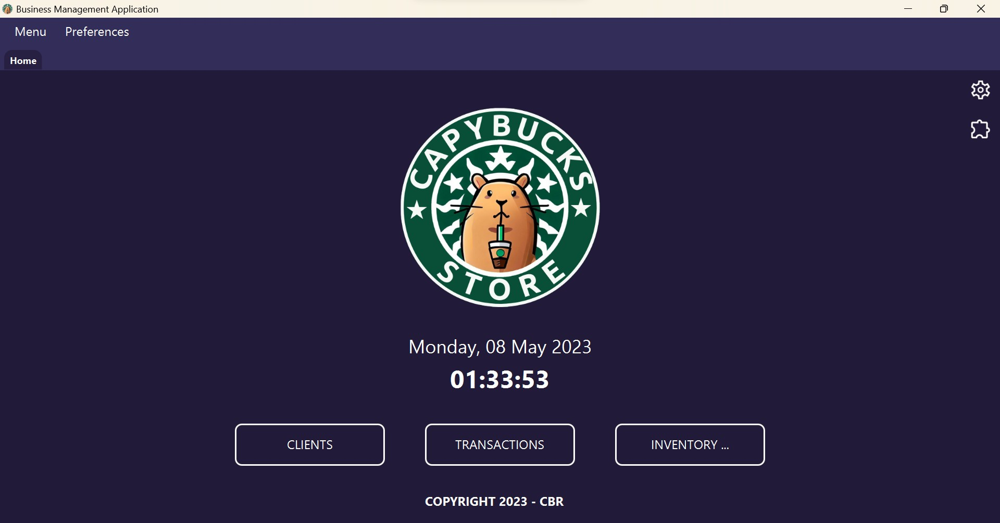
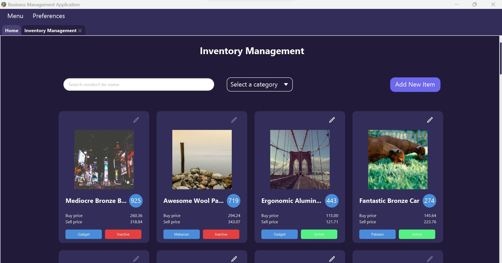
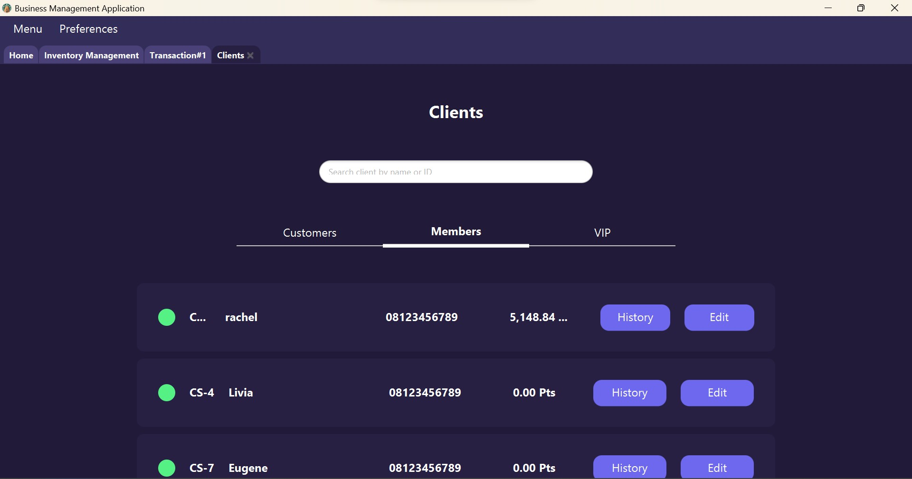
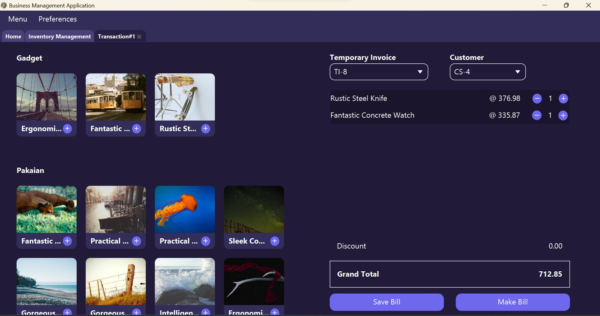

# Capybucks Store - Business Management App 
### 2nd Project IF2210 - Object Oriented Programming 2023
```
⠀⠀⠀⠀⠀⠀⠀⠀⠀⠀⠀⠀⠀⠀⠀⠀⠀⠀⠀⠀⠀⠀⠀⠀⠀⠀⠀⠀⠀⠀⠀⠀⠀⡀⠀⠀⠀⠀⠀⠀⠀⠀⠀⠀⠀⠀⠀⠀⠀⠀⠀⠀
⠀⠀⠀⠀⠀⠀⠀⠀⠀⠀⠀⠀⠀⠀⠀⠀⠀⠀⠀⠀⠀⠀⠀⠀⠀⠀⠀⣤⣶⣶⣆⠀⢸⣏⠓⢦⠀⠀⠀⠀⠀⠀⠀⠀⠀⠀⠀⠀⠀⠀⠀⠀
⠀⠀⠀⠀⠀⠀⠀⠀⠀⠀⠀⠀⠀⠀⠀⠀⠀⠀⠀⠀⠀⠀⠀⠀⠀⠀⣾⢳⣿⡏⣼⣀⣸⣿⣧⣸⣇⣀⠀⠀⠀⠀⠀⠀⠀⠀⠀⠀⠀⠀⠀⠀
⠀⠀⠀⠀⠀⠀⠀⠀⠀⠀⠀⠀⠀⠀⠀⠀⠀⠀⠀⠀⠀⠀⠀⠀⠀⠀⢿⣼⣿⡅⠻⠿⢄⣠⠠⣄⡀⠉⠛⠿⣷⣶⣤⣄⣀⠀⠀⠀⠀⠀⠀⠀
⠀⠀⠀⠀⠀⠀⠀⠀⠀⠀⠀⠀⠀⠀⠀⠀⠀⠀⠀⠀⠀⠀⠀⠀⠀⠀⢠⠟⠻⣿⣿⠂⢸⡧⠤⣼⣇⠀⠀⠀⠀⠉⣿⣿⣿⣷⣶⣄⠀⠀⠀⠀
⠀⠀⠀⠀⠀⠀⠀⠀⠀⠀⠀⠀⠀⠀⠀⠀⠀⠀⠀⠀⠀⠀⠀⠀⢀⣴⠃⠀⠀⠉⠀⠀⠈⠙⠛⢿⡿⠀⠀⠀⠀⢠⣿⠿⠿⣿⡿⠿⡆⠀⠀⠀
⠀⠀⠀⠀⠀⠀⠀⠀⠀⠀⣀⣀⡤⠤⠤⠶⠒⠒⠶⠶⠤⠤⠤⠖⠛⠁⠀⠀⠀⠀⠀⠀⠀⠀⠀⠀⠀⠀⠀⠀⠀⠸⣿⣼⣷⣾⣷⣿⡇⠀⠀⠀
⠀⠀⠀⠀⠀⠀⣀⡤⠖⠋⠉⠀⠀⠀⠀⠀⠀⠀⠀⠀⠀⠀⠀⠀⠀⠀⠀⠀⠀⠀⠀⠀⠀⠀⠀⠀⠀⠀⠀⠠⢤⣤⣄⡈⠉⢹⡏⠁⣽⠶⢴⠆
⠀⠀⠀⢀⣠⠞⠁⠀⠀⠀⠀⠀⠀⠀⠀⠀⠀⠀⠀⠀⠀⠀⠀⠀⠀⠀⠀⠀⠀⠀⠀⠀⠀⠀⠀⠀⠀⠀⠀⢀⣤⠴⠶⢿⠇⢸⡇⠰⡾⠶⠶⠀
⠀⠀⣠⠟⠁⠀⠀⠀⠀⠀⠀⠀⠀⠀⠀⠀⠀⠀⠀⠀⠀⠀⠀⠀⠀⠀⠀⠀⠀⠀⠀⠀⠀⠀⠀⠀⠀⠀⠀⠀⢠⡴⠚⠛⠀⢨⣧⣀⠟⢦⠀⠀
⠀⣼⡏⠀⠀⠀⠀⠀⠀⠀⠀⠀⠀⠀⠀⠀⠀⠀⠀⠀⠀⠀⠀⠀⠀⠀⠀⠀⠀⠀⠀⠀⠀⠀⠀⠀⠀⣀⡀⣠⣄⣴⣶⣶⣾⣿⠟⠉⠀⠀⠀⠀
⣸⣿⠀⠀⠀⠀⠀⠀⠀⠀⠀⠀⠀⠀⠀⠀⠀⠀⠀⠀⠀⠀⠀⠀⠀⠀⠀⠀⠀⠀⠀⠙⠻⡿⢿⣿⣾⣿⣿⣿⣿⣿⣿⠟⠋⠀⠀⠀⠀⠀⠀⠀
⣿⣿⣶⠀⠀⠀⠀⠀⠀⠀⠀⠀⠀⠀⠀⠀⠀⠀⠀⠀⠀⠀⠀⠀⠀⠀⠀⠀⠀⠀⠀⠀⠀⠀⠉⠉⠸⠟⠛⡽⠛⣿⡏⠀⠀⠀⠀⠀⠀⠀⠀⠀
⣿⣿⡇⣠⠀⠀⠀⠀⠀⠀⠀⠀⠀⠀⠀⠀⠀⠀⠀⠀⠀⠀⠀⠀⠀⠀⠀⠀⠀⠀⠀⠀⠀⠀⠀⠀⠀⠀⠀⠀⠀⣼⠀⠀⠀⠀⠀⠀⠀⠀⠀⠀
⣿⣿⣿⣿⠀⠀⠀⠀⠀⠀⠀⠀⠀⠀⠀⠀⠀⠀⠀⠀⠀⠀⠀⠀⠀⠀⠀⠀⠀⠀⠀⠀⠀⠀⠀⠀⠀⠀⠀⠀⠀⣿⠀⠀⠀⠀⠀⠀⠀⠀⠀⠀
⢻⣿⣿⣿⢀⡀⠀⠀⠀⠀⠀⠀⠀⠀⠀⠀⠀⠀⠀⠀⠀⠀⠀⠀⠀⣰⠀⠀⠀⠀⠀⠀⠀⠀⠀⠀⣴⠀⠀⠀⣿⡟⠀⠀⠀⠀⠀⠀⠀⠀⠀⠀
⠈⣿⣿⣿⣾⠀⠀⠀⠀⠀⠀⠀⠀⠀⠀⠀⠀⠀⠀⠀⠀⠀⠀⠀⣰⣿⠀⠀⠀⠀⠀⠀⠀⠀⣀⣾⠇⠀⢀⣿⠏⠀⠀⠀⠀⠀⠀⠀⠀⠀⠀⠀
⠀⢹⣿⣿⣿⣶⠀⠀⠀⠀⠀⠀⠀⠀⠀⠀⠀⠀⠀⠀⠀⡀⢀⣼⣿⣇⠀⠀⠀⠀⠀⠀⣠⣴⣿⢹⣀⣾⡾⠁⠀⠀⠀⠀⠀⠀⠀⠀⠀⠀⠀⠀
⠀⠀⢻⢿⣿⣿⠀⠀⠀⠀⠀⠀⠀⠀⠀⠀⠀⠀⠀⠀⣼⣧⣾⣿⣿⡏⣸⣇⣸⣀⣶⣴⣿⡇⣹⣾⣿⣿⠁⠀⠀⠀⠀⠀⠀⠀⠀⠀⠀⠀⠀⠀
⠀⠀⠀⠈⣿⣿⠀⠀⠀⠀⠀⠀⠀⠀⠀⠀⠀⣰⣠⣾⣿⣿⣿⣿⣿⣿⣻⣿⣿⣿⣿⣿⠛⢻⣿⣿⣿⡿⠀⠀⠀⠀⠀⠀⠀⠀⠀⠀⠀⠀⠀⠀
⠀⠀⠀⠀⢿⡟⠀⠀⠀⠀⣀⠀⢀⣤⣇⣠⣾⣿⣿⣿⣿⣿⣿⣿⣿⣿⣿⣿⣿⣿⣿⣿⠀⠀⣿⣿⣿⣷⣄⡀⠀⠀⠀⠀⠀⠀⠀⠀⠀⠀⠀⠀
⠀⠀⠀⠀⣿⠃⢀⣼⣷⣾⣷⣾⣿⣿⣿⣿⡿⢿⣿⣿⣿⣿⣿⢿⣿⣻⡿⠋⣿⣿⣿⣿⢧⣀⠻⠿⣿⣍⣺⣿⡷⠀⠀⠀⠀⠀⠀⠀⠀⠀⠀⠀
⠀⠀⠀⢠⡧⠼⠿⣟⣻⣿⢿⣿⣿⣿⣿⣿⣻⣻⠿⢭⣿⣳⣦⣍⠀⠀⠀⠀⠛⠿⢿⣮⣛⢮⣿⡆⠀⠀⠈⠉⠀⠀⠀⠀⠀⠀⠀⠀⠀⠀⠀⠀
⠀⠀⠀⠀⠀⠀⠀⠉⠉⠀⠉⠙⠉⠉⠉⠉⠙⠙⠛⠓⠛⠋⠉⠁⠀⠀⠀⠀⠀⠀⠀⠈⠉⠛⠉⠀⠀⠀⠀⠀⠀⠀⠀⠀⠀⠀⠀⠀⠀⠀⠀⠀
⠀⠀⠀⠀⠀⠀⠀⠀⠀⠀⠀⠀⠀⠀⠀⠀⠀⠀⠀⠀⠀⠀⠀⠀⠀⠀⠀⠀⠀⠀⠀⠀⠀⠀⠀⠀⠀⠀⠀⠀⠀⠀⠀⠀⠀⠀⠀⠀⠀⠀⠀⠀
❤ CBR--masbro
```
## Overview
>CBR Application - Business Management App is a desktop-based sales system (point-of-sales/POS) application, created using the Java programming language using the JavaFX library for the user interface. This application has features that are generally expected in a POS application, such as inventory management and transaction management. In addition, the application supports membership features to provide rewards to loyal customers; customers are divided into 3 categories, namely customers, members, and VIPs, with customers being the lowest level without rewards and VIPs being the highest level with the most rewards. The CBR Application - Business Management App also includes an export feature to PDF and provides extension/plug-in support to add program functionality.

This project is a Java implementation of Object Oriented Programming principles such as:
- Inheritance
- Composition
- Interface
- Polymorphism
- Method Overriding and Method Overloading
- Java API Collection
- S.O.L.I.D. principles
- Design Pattern (Adapter, Singleton, Decorator, Builder, Flyweight)
- Reflection
- Threading

This project is built to meet the following [guidelines](https://docs.google.com/document/d/1SA2q8LrSiYntjCQ9Sx6xIGIAVYe6kcZg5iBjgibcEfk/edit#).

## Preview
1. Main Page
 
2. Inventory
 
3. Clients
 
4. Transaction
 
5. Plugin 


6. Settings (with Plugin-Systems loaded)


7. Plugin-Chart-1


8. Plugin-Chart-2


9. Plugin-System-1


10. Plugin-System-2 (with Plugin-System-1 loaded)


11. Exported PDF (with Plugin-System-1 loaded)


## Prerequisites
- Java
- Maven, to install refer to : `https://phoenixnap.com/kb/install-maven-windows`
- Java JDK installed on WSL, to install :
- Amazon Coretto 8

## How to Run
1. Clone this repository.

```
 $ git clone https://github.com/JeffreyChow19/CBR-Business-Management-App.git
 ```
or
```
 $ git clone git@github.com:JeffreyChow19/CBR-Business-Management-App.git
```
2. Open terminal and navigate to the root directory of this repository, then navigate to App directory.
```
 $ cd App
```
3. <br/>
(Without Jar) run this command
```bash
 $ mvn clean javafx:run
```
(With jar) run this command
```
 $ java -jar target/app-1.0-jar-with-dependencies.jar
```
## Adding Dependencies
1. Go to `pom.xml`
2. Add new dependecy under `<!-- Add Another Dependencies Here -->` tag

## Using Lombok and JetBrains Annotation
Please refer to `src/main/java/com/Person.java`

## Directory Structure
```
├───.idea
├───doc
├───App
│   ├───assets
│   │   ├───data
│   │   │   ├───json
│   │   │   ├───obj
│   │   │   └───xml
│   │   ├───icons
│   │   ├───images
│   │   │   └───products
│   │   └───styles
│   ├───src
│   │   └───main
│   │       └───java
│   │           └───com
│   │               └───cbr
│   │                   ├───datastore
│   │                   ├───exception
│   │                   ├───models
│   │                   │   └───Pricing
│   │                   ├───plugin
│   │                   ├───seeder
│   │                   ├───utils
│   │                   └───view
│   │                       ├───components
│   │                       │   ├───buttons
│   │                       │   ├───cards
│   │                       │   │   └───clientcard
│   │                       │   ├───cardslist
│   │                       │   ├───clockwidget
│   │                       │   ├───form
│   │                       │   │   └───dropdown
│   │                       │   ├───header
│   │                       │   │   ├───headermenu
│   │                       │   │   └───tabmenu
│   │                       │   ├───labels
│   │                       │   ├───logo
│   │                       │   ├───popup
│   │                       │   └───spinner
│   │                       ├───pages
│   │                       └───theme
│   └───target
│       ├───classes
│       │   ├───com
│       │   │   └───cbr
│       │   │       ├───datastore
│       │   │       ├───exception
│       │   │       ├───models
│       │   │       │   └───Pricing
│       │   │       ├───plugin
│       │   │       ├───seeder
│       │   │       ├───utils
│       │   │       └───view
│       │   │           ├───components
│       │   │           │   ├───buttons
│       │   │           │   ├───cards
│       │   │           │   │   └───clientcard
│       │   │           │   ├───cardslist
│       │   │           │   ├───clockwidget
│       │   │           │   ├───form
│       │   │           │   │   └───dropdown
│       │   │           │   ├───header
│       │   │           │   │   ├───headermenu
│       │   │           │   │   └───tabmenu
│       │   │           │   ├───labels
│       │   │           │   ├───logo
│       │   │           │   ├───popup
│       │   │           │   └───spinner
│       │   │           ├───pages
│       │   │           └───theme
│       │   └───styles
│       ├───generated-sources
│       │   └───annotations
│       └───maven-status
│           └───maven-compiler-plugin
│               └───compile
│                   └───default-compile
├───Plugin-Base
│   ├───src
│   │   └───main
│   │       └───java
│   │           └───com
│   │               └───cbr
│   └───target
│       ├───archive-tmp
│       ├───classes
│       │   └───com
│       │       └───cbr
│       ├───generated-sources
│       │   └───annotations
│       ├───generated-test-sources
│       │   └───test-annotations
│       ├───maven-archiver
│       ├───maven-status
│       │   └───maven-compiler-plugin
│       │       └───compile
│       │           └───default-compile
│       └───test-classes
├───Plugin-Chart-1
│   └───src
│       └───main
│           ├───java
│           │   └───com
│           │       └───cbr
│           └───resources
│               └───META-INF
│                   └───services
├───Plugin-Chart-2
│   ├───src
│   │   └───main
│   │       ├───java
│   │       │   └───com
│   │       │       └───cbr
│   │       └───resources
│   │           └───META-INF
│   │               └───services
│   └───target
│       ├───classes
│       │   ├───com
│       │   │   └───cbr
│       │   └───META-INF
│       │       └───services
│       ├───generated-sources
│       │   └───annotations
│       ├───generated-test-sources
│       │   └───test-annotations
│       └───test-classes
├───Plugin-System-1
│   ├───src
│   │   └───main
│   │       ├───java
│   │       │   └───com
│   │       │       └───cbr
│   │       └───resources
│   │           └───META-INF
│   │               └───services
│   └───target
│       ├───archive-tmp
│       ├───classes
│       │   ├───com
│       │   │   └───cbr
│       │   └───META-INF
│       │       └───services
│       ├───generated-sources
│       │   └───annotations
│       ├───generated-test-sources
│       │   └───test-annotations
│       ├───maven-archiver
│       ├───maven-status
│       │   └───maven-compiler-plugin
│       │       └───compile
│       │           └───default-compile
│       └───test-classes
└───Plugin-System-2
    ├───src
    │   └───main
    │       ├───java
    │       │   └───com
    │       │       └───cbr
    │       └───resources
    │           └───META-INF
    │               └───services
    └───target
        ├───archive-tmp
        ├───classes
        │   └───com
        │       └───cbr
        ├───generated-sources
        │   └───annotations
        ├───generated-test-sources
        │   └───test-annotations
        ├───maven-archiver
        ├───maven-status
        │   └───maven-compiler-plugin
        │       └───compile
        │           └───default-compile
        └───test-classes
```

## Authors

| Name                  | GitHub                                            | NIM                  |
| --------------------- | ------------------------------------------------- | --------------------- |
| Alexander Jason       | [AJason36](https://github.com/AJason36)           | 13521100 |
| Angela Livia Arumsari | [liviaarumsari](https://github.com/liviaarumsari) | 13521094 |
| Eugene Yap Jin Quan   | [yuujin-Q](https://github.com/yuujin-Q)           | 13521074 |
| Jeffrey Chow          | [JeffreyChow19](https://github.com/JeffreyChow19) | 13521046 |
| Nathaniel Evan        | [nathanielevan](https://github.com/nathanielevan) | 13516055 |
| Rachel Gabriela Chen  | [chaerla](https://github.com/chaerla)             | 13521044 |

